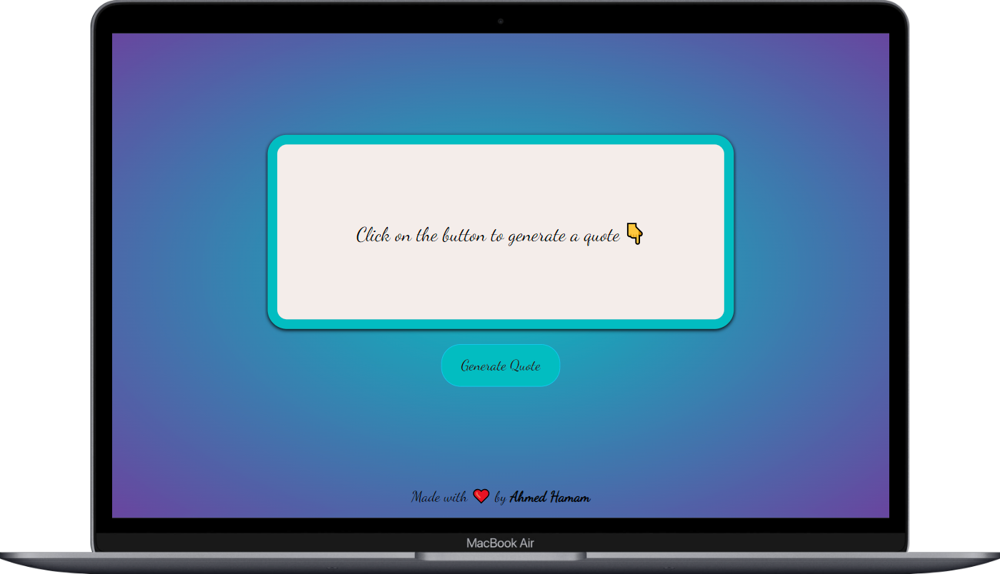

# Random Quote Generator

A simple and interactive web application that generates random quotes from famous authors. With each click, users are presented with a new inspirational quote. This project was built using HTML, CSS, and JavaScript, offering a clean and user-friendly interface for quick access to motivational content.

## Live Demo
Explore the Random Quote Generator [here](https://ahmedhamamm.github.io/Random-Quote-Generator/).

## Screenshot
Here’s a preview of the Random Quote Generator in action:

## Features
- **Random Quotes**: Generates a new random quote with each click.
- **Author Information**: Each quote includes the name of the author.
- **Clean UI**: Minimalist design to keep focus on the quote.
- **Responsive Design**: Works seamlessly across different screen sizes, including mobile devices.

## How It Works
1. A list of quotes is predefined in the JavaScript file.
2. Each time the "Generate Quote" button is clicked, a random quote from the list is selected and displayed on the page.
3. The quote accompanies the author's name for proper attribution.

## Contact
If you have any questions, feedback, or suggestions regarding the project, feel free to reach out:

- **GitHub**: [AhmedHamam](https://github.com/AhmedHamamm)
- **LinkedIn**: [AhmedHamam](https://www.linkedin.com/in/ahmed--hamam/)
- **Email**: contact@ahamam.com

You can also submit an issue or pull request via the [GitHub Repository](https://github.com/AhmedHamamm/Random-Quote-Generator/issues) if you'd like to contribute or report any bugs.
